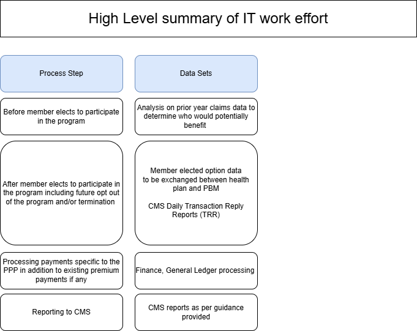

# Prescription Payment Program (PPP)

## Project Overview
The **Prescription Payment Program (PPP)** is a federal government-mandated initiative by the Centers for Medicare & Medicaid Services (CMS). It ensures that health plans provide real-time prescription cost-sharing information to beneficiaries at the point of sale. This project demonstrates the implementation of the program for a health plan, ensuring CMS compliance and seamless integration with pharmacy benefit managers (PBMs).

- https://www.cms.gov/files/document/medicare-prescription-payment-plan-final-part-one-guidance.pdf
- https://www.cms.gov/files/document/fact-sheet-medicare-prescription-payment-plan-final-part-one-guidance.pdf
- https://www.cms.gov/files/document/medicare-prescription-payment-plan-timeline.pdf
- https://www.medicare.gov/prescription-payment-plan

## Project Goals
- Enable real-time prescription cost transparency.
- Integrate with CMS endpoints and PBM platform.
- Ensure HIPAA and CMS compliance for secure data exchange.
- Automate data reporting and error tracking.

## Solution Architecture 
As an IT Architect, I led the end-to-end solution design and implementation:
Note - This is an option I would recommend to implement this program.


- **Architecture:** Event-driven microservices
- **Cloud:** AWS (Lambda, API Gateway, S3, SNS/SQS)
- **API:** RESTful endpoints with Swagger/OpenAPI documentation
- **Infrastructure as Code (IaC):** Terraform and AWS CDK
- **CI/CD:** GitHub Actions for automated deployment
- **Security:** OAuth2.0, JWT, and CMS-compliant encryption

## Key Features
1. **Real-Time Cost Sharing:** APIs to calculate and share prescription costs instantly.
2. **PBM Integration:** Seamless data exchange with third-party PBMs.
3. **Automated Reporting:** Scheduled jobs for CMS compliance reporting.
4. **Monitoring & Alerts:** CloudWatch-based health checks.
5. **Error Handling:** Robust retry mechanisms using AWS SQS.

## Architecture Diagram

![Architecture Diagram] - Work in progress

## Technologies Used

- **Cloud Platform:**    AWS (Lambda, API Gateway, S3)
- **Infrastructure:**    Terraform, AWS CDK
- **API & Data:**        REST, FHIR, Swagger/OpenAPI
- **CI/CD:**             GitHub Actions, CodePipeline
- **Security:**          OAuth2.0, JWT, Encryption
- **Monitoring:**        CloudWatch, Grafana

## Repository Structure
```
.
├── README.md          # Project overview and documentation
├── docs/              # Architecture diagrams and design documents
├── src/               # Sample code for APIs and automation
├── workflows/         # CI/CD pipeline configurations
├── api/               # OpenAPI specifications
├── deployment/        # Terraform and AWS CDK templates
├── tests/             # Automated test scripts
├── reports/           # Success metrics and dashboards
└── LICENSE            # Optional license for sharing
```

## Deployment
1. Clone the repository:
```bash
git clone https://github.com/yourusername/Prescription-Payment-Program-CMS.git
```
2. Set up AWS credentials.
3. Deploy infrastructure using Terraform:
```bash
cd deployment
terraform init
terraform apply
```
4. Deploy APIs and Lambda functions:
```bash
cd src
npm install
npm run deploy
```

## Project Outcomes
- Achieved CMS compliance by [Go-Live Date].
- Reduced prescription cost-sharing errors by **30%**.
- Streamlined PBM integration with real-time tracking.
- Successfully processed **500,000+ transactions** monthly.

## Documentation
- [Solution Architecture](docs/solution-architecture.md)
- [API Endpoints](api/swagger.yaml)
- [Deployment Guide](docs/deployment-guide.md)
- [Compliance Checklist](docs/cms-compliance.md)

## Lessons Learned
- Importance of end-to-end encryption for HIPAA compliance.
- Efficient API throttling for high-volume transactions.
- Automated alerting for faster issue resolution.

## Contributing
Contributions are welcome! Please submit a pull request or open an issue for discussions.

## Contact
For inquiries or collaboration opportunities, connect with me on via email at [nkiran.kasi@gmail.com]

## License
This project is licensed under the MIT License. See [LICENSE](LICENSE) for details.

---
💡 *This repository demonstrates solution architecture and best practices while ensuring confidentiality. No sensitive data is included.*
